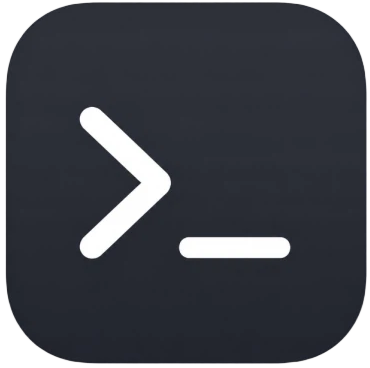

# terminus

<p align="center">
  
</p>

一个基于 Electron、Vue 3 和 TypeScript 构建的现代桌面终端工作区。

## 功能特性

- 原生终端能力：主进程通过 `node-pty` 启动系统 Shell，渲染进程使用 `xterm.js` 展示和交互。
- 多 Tab 工作区：支持新建、关闭、中键关闭、拖拽排序、双击重命名和 `Ctrl+Tab` / `Ctrl+Shift+Tab` 切换。
- 分屏布局：支持左右分屏、上下分屏、拖动分隔条调整比例。
- 拖拽重排：支持拖动单个终端 Pane 或整个分屏组到目标 Pane 的上下左右位置。
- 路径继承：新建分屏和新建 Tab 可以继承当前工作目录。
- 路径收藏：收藏当前路径、搜索过滤、拖拽排序，点击可在新 Tab 打开。
- 终端渲染：可选 WebGL 加速渲染，关闭时回退 Canvas。
- 外观设置：可配置字体、字号、主题色、背景图、背景遮罩透明度和模糊，全部持久化。
- 窗口能力：无边框窗口、窗口置顶、窗口大小与位置记忆（含多显示器可见性校验）、`F11` 全屏、界面缩放。
- 快捷键设置：可视化修改全部快捷键，带冲突检测和恢复默认。
- 命令完成通知：Windows 下窗口未聚焦时，命令执行结束会发送系统通知。
- 复制粘贴：`Alt+C` 复制选中文本并显示提示，`Ctrl+V` 粘贴剪贴板内容。
- opencode 主题同步：主题色变化时同步写入 opencode 的自定义主题文件。
- 启动动画：应用启动时显示品牌化 splash 过渡。

## 技术栈

- Electron 39
- Electron Vite
- Vue 3
- TypeScript
- Tailwind CSS 4
- reka-ui（shadcn-vue 风格的自绘组件）
- lucide 图标
- xterm.js
- node-pty
- pnpm

## 项目结构

```text
src/
  main/                Electron 主进程
    app/               窗口创建、生命周期和系统环境变量加载
    ipc/               settings、terminal、window IPC 注册
    opencode/          向 opencode 同步自定义主题
    settings/          设置持久化和默认值
    shared/            主进程内部共用工具
    terminal/          node-pty 管理、cwd 追踪和输出背压
  preload/             预加载脚本，向渲染进程暴露安全的 IPC API
  renderer/src/        Vue 渲染进程，负责终端工作区 UI 和交互
    components/        TerminalWorkspace、TerminalPane、SplitNode 等核心组件
    components/ui/     reka-ui 包装组件
    types/             终端布局和设置相关类型
    utils/             分屏树操作等纯函数
  shared/              主进程与渲染进程共用的类型和工具（快捷键）
```

关键入口：

- `src/main/index.ts`：主进程入口，注册应用生命周期、IPC 和窗口。
- `src/main/ipc/registerIpc.ts`：集中注册设置、终端和窗口 IPC。
- `src/main/terminal/terminalService.ts`：管理 PTY 生命周期、输出背压和 Windows 下的自动重建。
- `src/main/settings/settingsService.ts`：读写并规范化 `settings.json`。
- `src/preload/index.ts`：暴露 `window.api`，渲染进程通过它访问终端、设置、剪贴板和窗口能力。
- `src/renderer/src/App.vue`：应用根组件，注入主题色变量并显示启动动画。
- `src/renderer/src/components/TerminalWorkspace.vue`：管理 Tab、分屏布局、窗口控制和快捷键分发。
- `src/renderer/src/components/TerminalPane.vue`：单个终端 Pane，集成 xterm.js。
- `src/renderer/src/components/SettingsView.vue`：设置面板。
- `src/shared/shortcuts.ts`：主进程与渲染进程共用的快捷键定义、校验和匹配逻辑。

## 环境要求

- Node.js 22（CI 使用版本）
- pnpm 10（CI 使用版本）

本项目包含原生依赖 `node-pty`，安装依赖后会通过 `electron-builder install-app-deps` 安装 Electron 原生模块依赖。

仓库通过 `.gitattributes` 强制所有文本文件使用 LF 行尾（`.editorconfig` 同样要求 LF）。如果本地 `core.autocrlf=true` 把文件检出成 CRLF，`pnpm lint` 和 `pnpm format:check` 会报出大量 `Delete ␍` 问题，执行一次 `pnpm format` 或重新检出即可恢复。

## 安装依赖

```bash
pnpm install
```

## 本地开发

```bash
pnpm dev
```

## 预览构建产物

```bash
pnpm start
```

## 代码检查

```bash
pnpm lint
pnpm format:check
pnpm typecheck
```

也可以只检查某一端：

```bash
pnpm typecheck:node
pnpm typecheck:web
```

## 构建

```bash
pnpm build
```

如需只生成未打包目录：

```bash
pnpm build:unpack
```

## 平台打包

```bash
# Windows
pnpm build:win

# macOS
pnpm build:mac

# Linux
pnpm build:linux
```

GitHub Actions 当前发布构建使用 Windows x64：`pnpm build:win -- --x64`。

## 终端行为

- Windows 默认启动 `powershell.exe -NoLogo -NoExit -Command <cwd prompt hook>`。
- 非 Windows 平台默认使用 `process.env.SHELL`，未配置时回退到 `/bin/bash`。
- 终端 Pane 的 ID 由渲染进程生成，并作为主进程 PTY Map 的 key。
- 主进程通过 PowerShell prompt hook 追踪当前工作目录，新建分屏会继承来源 Pane 的 cwd。
- 输出中的 OSC 633（Windows）与 OSC 7 序列用于解析 cwd 和命令退出码，跨包截断的序列会被缓存后重新拼接。
- PTY 输出按 100KB 分块发送，并带字节级背压：渲染进程写入 xterm 后回传 `ackData`，未确认数据超过阈值时主进程会暂停 PTY。
- Windows 下 PTY 退出后会自动重建，采用指数退避（最多连续 5 次，稳定运行 10 秒后计数清零）；面板已关闭或已被同一 ID 重建时不会重建。
- 关闭 Tab 或 Pane 时会调用 `window.api.terminal.kill` 清理对应 PTY，避免残留进程。

## 快捷键

默认快捷键可在设置面板中修改：

| 操作                   | 默认快捷键                         |
| ---------------------- | ---------------------------------- |
| 新建 Tab               | `Ctrl+T`                           |
| 下一个 / 上一个 Tab    | `Ctrl+Tab` / `Ctrl+Shift+Tab`      |
| 切换分屏焦点           | `` Ctrl+` ``                       |
| 向右 / 向下分屏        | `Ctrl+→` / `Ctrl+↓`                |
| 关闭当前分屏           | `Ctrl+W`                           |
| 复制选中文本 / 粘贴    | `Alt+C` / `Ctrl+V`（兼容 `Alt+V`） |
| 最小化窗口             | `Alt+H`                            |
| 放大 / 缩小 / 重置缩放 | `Alt+=` / `Alt+-` / `Alt+0`        |

`Ctrl+滚轮` 也可以调整终端字号。

## 设置持久化

终端字体、字号、渲染方式、背景图、主题色、快捷键、窗口状态和 Tab 会话会保存到 Electron 的 `userData` 目录下的 `settings.json`，读取时会逐字段做边界校验和归一化。

当前默认设置：

- 字体：`"Maple Mono NF CN", Cascadia Mono, Consolas, monospace`
- 字号：`14`
- 主题色：`#8d9dd5`
- WebGL 渲染：关闭
- 背景图：启用（未选择图片时无背景）
- 背景遮罩：`60%`，背景模糊：`0px`
- 界面缩放：`1.0`（范围 `0.5`–`3.0`）
- 窗口按钮风格：跟随系统
- 窗口大小与位置：记忆（默认 `900 × 670`）
- 新建标签路径：继承当前标签路径
